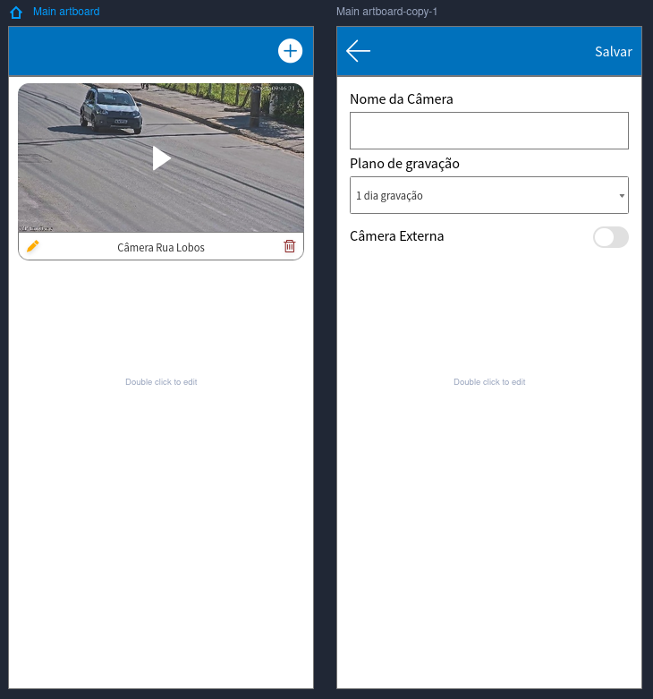

# ReactTest

## Test



### Font Awesome

We'll be using font awesome for icons in our application.
Here's a sample that should be enough for you to make the app:

```typescript
import { FontAwesomeIcon } from '@fortawesome/react-fontawesome';
import { faTrashCan } from '@fortawesome/free-solid-svg-icons';

// on tsx use:
function App() {
    return (
        <FontAwesomeIcon icon={faTrashCan} color="red" size='2x' />
    )
}
```

For this test, you'll be using the icons `faPencil`, `faTrashCan`, `faArrowLeft`, `faPlay` and `faPlusCircle`.

If you want to know more... Feel free to see the [official documentation](https://fontawesome.com/v6/docs/web/use-with/react/).

## Install

### How to Install?

```bash
nvm use
npm install
```

### Expo-Cli

If it the first time that you are running the application, you need to install expo-cli globally. You can see more [Here](https://docs.expo.dev).

```bash
nvm use
npm install --global expo-cli
```

### How to run?

```bash
nvm use
npm run web
```

#### Known Issues

If you get the error `ENOSPC: System limit for number of file watchers reached` on running ReactTest application and you're running Linux, get a look on:

<https://stackoverflow.com/questions/55763428/react-native-error-enospc-system-limit-for-number-of-file-watchers-reached>
